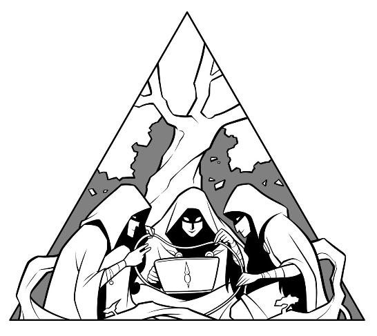

#  DMVPN Configuration with Nornir 



This repository concentrates on automating the deployment of a multi-VRF DMVPN network. It's common for these networks to grow in terms of spokes and number of VRFs. Sometimes so much that the manageability takes a hit. Therefore, modeling the deployment as Infra as Code helps to mitigate issues and avoid mistakes when deploying or changing something in the existing deployment. It's also easy to re-run the scripts to make sure all configuration is as it should. Checking this manually each device at a time is time consuming to say the least.

To run the code:
- Clone the repository
- Launch a Python 3.x virtual enviroment (VENV): ```python -m venv .```
- Install dependencies: ```pip3 install -r requirements.txt```
- Adjust ```config_data``` with your own variables
- Execute the scripts:
    - ```python3 deploy_hubs.py```
    - ```python3 deploy_spokes.py```
